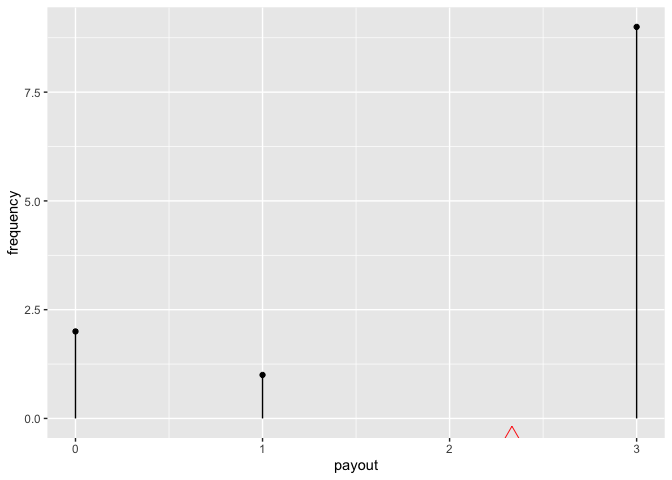
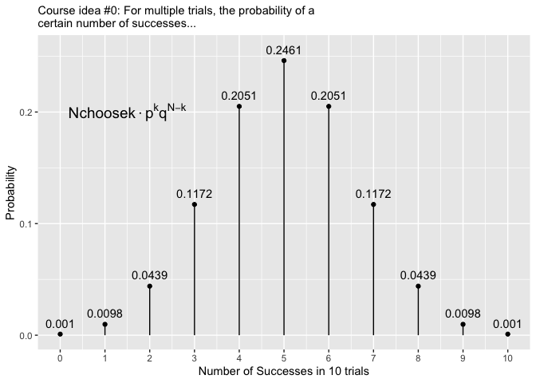
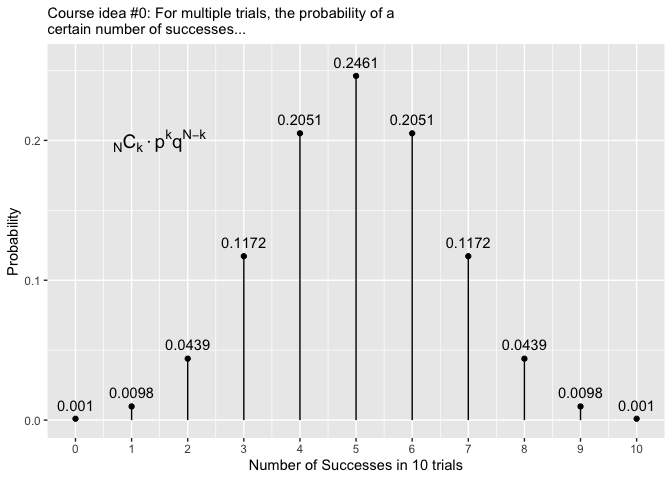

See also:

  - more learning materials:
    <https://github.com/EvaMaeRey/ay_2023_2_advanced_individual_study>
  - sibling project: <https://github.com/EvaMaeRey/ma206equations>

## Title

Easily visualize common distributions for statistical and probabilistic
analytics in ggplot2

## Abstract

Mathematical fluency involves frequent use of probability distributions.
However, visualizing these distributions can be tedious. In a classroom
setting with a given curriculum, the set of distributions to be mastered
is well defined. Having shortcuts to produce these distributions in
prose or plots could be beneficial for students and instructors alike.
The goal of this independent study is to create functions that will
quickly deliver beautiful visual representations of probability
distributions. We will make these functions available in an R package.

## Which distributions are relevant for the statistics and probability course?

A good start for looking at the core of distributions in the ma206
course guide.

## Objectives

1.  Provide additional **dataframes** for ma206 that are probabilities
    from curriculum (probability problems in text book).  
2.  Provide *stamp* functions for binomial and geometric distributions
    (normal and t exist in ggxmean); also think about rewrite for
    stamp\_normal (i.e. what should height distribution look like?)
3.  Let’s try: shiny app which 1) demonstrates distribution
    characteristics 2) showcases new functions quoting back ggplot code
4.  stretch? sampling from distributions function or guidance..

## Tidying data from discrete random variable problems

Tidying up data is important so that when the data is inputted into R or
any coding language it is easier to interpret what the data specifies.

The textbook examples were changed into tidy data notation. First, we
made the variables the columns.

For example, in the spinning of the prize wheel with sectors of various
prize award amounts, sector\_type, frequency, and payout are the column
headers for each variable column. Then each row forms an observation.
For example, in the spinning of the prize wheel, we had no prize, win
$1, and win $3. From there the observational units either quantitative
or qualitative makes up the meat of the table. See Table 1 for a good
example of tidy data. This process of “tidying” data creates a
well-organized and structured format that is easier for data analysis
and visualization.

| sector\_type | frequency | payout |
| :----------- | --------: | -----: |
| No Prize     |         2 |      0 |
| Win $1       |         1 |      1 |
| Win $3       |         9 |      3 |

In the text book as with many resources, the original layout of the
table not a ‘tidy’ dataframe, but is transposed, wide table

|              |          |        |        |
| :----------- | :------- | :----- | :----- |
| sector\_type | No Prize | Win $1 | Win $3 |
| frequency    | 2        | 1      | 9      |
| payout       | 0        | 1      | 3      |

<http://www.stat.yale.edu/Courses/1997-98/101/ranvar.htm#>:\~:text=A%20discrete%20random%20variable%20is,then%20it%20must%20be%20discrete.

``` r
library(tidyverse)
library(ma206distributions)
```

In our package we include the data structured in this way, and call the
object `prize_wheel`

``` r
print(prize_wheel)
```

    ##   sector_type frequency payout
    ## 1    No Prize         2      0
    ## 2      Win $1         1      1
    ## 3      Win $3         9      3

We see that we can easily visualize the joint distribution of payout and
frequency using the ggplot2 tool that is used in the statistics part of
the class.

``` r
prize_wheel %>% 
  ggplot() + 
  aes(x = payout) + 
  aes(y = frequency) +
  geom_lollipop()
```

<!-- -->

``` r
library(tidyverse)
library(ggxmean)

ggxmean:::stamp_space() + 
  stamp_normal_dist()
```

<!-- -->

# Project timeline

| Timing      | Activity and Deliverable                                                                             | Hours |
| ----------- | ---------------------------------------------------------------------------------------------------- | ----- |
| 0-3 weeks   | Background on writing functions in R and package architecture                                        | 15    |
| 3-6 weeks   | ggplot2 programming basics                                                                           | 15    |
| 6-10 weeks  | Building functionality easily visualizing probability distributions (normal, t, binomial, geometric) | 15    |
| 10-12 weeks | Showcasing and soliciting feedback                                                                   | 15    |
| 12-15 weeks | Incorporating feedback                                                                               | 10    |
| Final       | Report and presentation.                                                                             | 10    |

# Some initial code ideas…

Below, we do some of the visualization with base R and base ggplot2. The
aim is to provide code that feels much more effortless and fun to use to
visualize distributions.

## Visualizing a binomial distribution without {ma206distributions} functions

The equations in the plot were produce in the following fashion (no
functions or package pre-built):

``` r
library(tidyverse)


latex2exp::TeX("${{N}\\choose{k}} \\cdot p^kq^{N-k}$")
```

    ##    LaTeX: ${{N}\choose{k}} \cdot p^kq^{N-k}$ 
    ## plotmath: {{N}*choose * {k}} %.% p^{k}*q^{N - k}

``` r
single_trial_prob <- .5
num_trials <- 10
0:num_trials ->
  possible_outcomes
dbinom(x = possible_outcomes,
       size = 10,
       prob = single_trial_prob) ->
  probs
tibble(possible_outcomes, probs) %>%
  ggplot() +
  aes(x = possible_outcomes) +
  scale_x_continuous(breaks = possible_outcomes) +
  aes(y = probs) +
  geom_point(fill = "white") +
  aes(xend = possible_outcomes,
      yend = 0) +
  geom_segment() +
  labs(subtitle = "Course idea #0: For multiple trials, the probability of a certain number of successes..." %>%
         str_wrap(60),
       x = "Number of Successes in 10 trials",
       y = "Probability") +
  geom_text(aes(label = probs %>% round(4)),
            nudge_y = .01) + 
    annotate(geom = "text",
    x = 1.5,
    y = .2,
    label = "{{N}*choose * {k}} %.% p^{k}*q^{N - k} ",
    parse = TRUE,
    size = 5) ->
    binomial_distribution

binomial_distribution
```

<!-- -->

## Visualizing a Discrete Random Variable without {ma206distributions} functions

Probability problems could be structured as data frames visualized with
the same tools used in the stats part of the class.

``` r
tibble(event = c("totaled", "fender bender", "accident free"),
       probability = c(.01, .09, .9),
       payout = c(20000, 5000, 0)) ->
expected

plotmath_ev <- latex2exp::TeX("$E[X] = x_1p_1 + x_2p_2 + x_3p_3 ...x_np_n = \\sum_1^n{x_ip_i}$")

plotmath_var <- latex2exp::TeX("$Var(X) = E[(X-\\mu)^2] = \\sigma^2_x = \\sum_1^n(x_i-\\mu)^2p_i$")

plotmath_sd <- latex2exp::TeX("$\\sigma_x = SD(X) = \\sqrt{Var(X)}$")


expected %>% 
  ggplot() + 
  aes(x = payout, y = probability) + 
  geom_point() + 
  geom_segment(aes(xend = payout, yend = 0)) + 
  geom_text(aes(label = probability), size = 5, 
            vjust = -.5, color = "black") + 
  ggxmean::geom_x_mean(aes(weight = probability)) + 
  geom_vline(xintercept = sum(c(.01*20000, .09*5000)),
             linetype = "dashed", color = "black") + 
  labs(subtitle = "Course idea 8:  The expected value E.V. is the 'balancing point' of a Random variable, X.  It is the weighted average of values, (weighting values by their probabilities). In large samples from the X, the average will be close to the E.V.;" %>% str_wrap(60)) + 
  annotate(geom = "label", x =sum(c(.01*20000, .09*5000)), label = sum(c(.01*20000, .09*5000)), y = .5 ) + 
  scale_y_continuous(limits = c(0,1)) + 
  annotate(geom = "text", label = plotmath_ev, parse = T,
           x = 12000, y = .95) +
  annotate(geom = "text", label = plotmath_var, parse = T,
           x = 12000, y = .8) +  
  annotate(geom = "text", label = plotmath_sd, parse = T,
           x = 12000, y = .65) ->
discrete_random
```

    ## Warning: Ignoring unknown aesthetics: weight

``` r
discrete_random
```

    ## Warning in is.na(x): is.na() applied to non-(list or vector) of type
    ## 'expression'

    ## Warning in is.na(x): is.na() applied to non-(list or vector) of type
    ## 'expression'
    
    ## Warning in is.na(x): is.na() applied to non-(list or vector) of type
    ## 'expression'

<!-- -->

See also:

  - <https://evamaerey.github.io/mytidytuesday/2022-08-01-dbinom-dgeom/dbinom_dgeom.html>
  - <https://evamaerey.github.io/mytidytuesday/2022-08-01-dbinom-dgeom/dbinom_dgeom_flipbook.html>

# Tools

### How do we bundle up our work into concept-sized usable bits? Functions.

### How do we bundle up related functions? Packages.

  - We will still follow the steps outlined in this data package readme:
    <https://github.com/EvaMaeRey/tidytitanic>
  - As well as consult the package building guide:
    <https://evamaerey.github.io/package_in_20_minutes/package_in_20_minutes>

### How do we collaborate and share the package? Version Control.

  - create a github account for collaboration <https://github.com/>
  - we’ll make the repository available in this account
