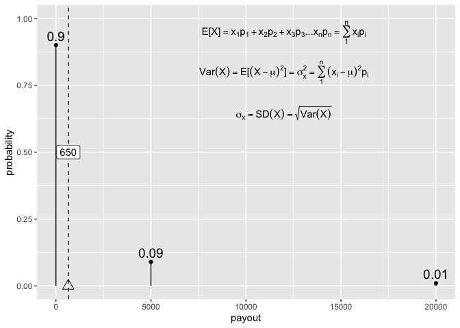

## ma206distributions

The `ma206distributions` package allows you to easily visualize common
distributions for statistical and probabilistic analytics in ggplot2.

## Abstract

Mathematical fluency involves frequent use of probability distributions.
However, visualizing these distributions can be tedious. In a
well-defined statistics and probability curriculum, the set of
distributions to be mastered is known and limited. In such settings
having shortcuts to produce or ingest these distributions in analytic
software for display and analysis could be beneficial for students and
instructors alike. The goal of this project is to provide ready-to-use
objects (data frames) and functions that will make it easier to engage
computationally with these distributions. We make these objects and
functions available in the R package `ma206distributions`.

## Which distributions are relevant for the statistics and probability course?

In the MA206 course, we’ve identified the normal, binomial, and
geometric distributions as targets to be used and mastered. In addition,
students should be able to assess implications given random discrete
variable distributions (constructed distributions).

## Objectives

1.  Provide functions that return data frames relating outcomes and
    probabilities for binomial and geometric distributions
2.  Providing quick-viz *stamp* functions for binomial and geometric
    distributions (normal and t exist in ggxmean). *Wishlist: also think
    about rewrite for stamp\_normal (i.e. what should height
    distribution look like?)*
3.  Provide additional **dataframes** for ma206 that are probabilities
    from curriculum (probability problems in text book). These might be
    moved to ma206data package at some point.
4.  Provide interactive app which 1) demonstrates distribution
    characteristics, allowing easy manipulation of parameters 2)
    connects to new package functionality by quoting back code
    underlying the app.

### Objective \#1. provide data frames that relate outcomes and probabilities

#### The problem

Currently, students may use R as a calculator for quick computation of
probabilistic quantities. However, using existing methodologies may
divorce quantities from useful context.

For example, consider the question: What is the probability of rolling a
6 exactly 2 times in eight die rolls (fair di).

Solving that problem with current toolbox might look like this.

``` r
dbinom(x = 2, size = 8, prob = 1/6)
```

    ## [1] 0.2604762

This solution is concise, but lacks context, and doesn’t nicely parlay
to answer other related and adjacent questions.

We propose instead that a full set of paired outcomes and probabilities
be made available to students when asking this question via the
ma206distributions function `tidy_dbinom`. To answer the preceding
question, then, students would consult the table that they produce using
the function:

``` r
library(ma206distributions)
options(scipen = 8, digits = 3)
tidy_dbinom(single_trial_prob = 1/6, 8)
```

    ## # A tibble: 9 × 4
    ##   num_successes probability single_trial_prob num_trials
    ##           <int>       <dbl>             <dbl>      <dbl>
    ## 1             0 0.233                   0.167          8
    ## 2             1 0.372                   0.167          8
    ## 3             2 0.260                   0.167          8
    ## 4             3 0.104                   0.167          8
    ## 5             4 0.0260                  0.167          8
    ## 6             5 0.00417                 0.167          8
    ## 7             6 0.000417                0.167          8
    ## 8             7 0.0000238               0.167          8
    ## 9             8 0.000000595             0.167          8

Consulting the table, the students would find the ‘2 successes’ outcome
and find the associated probability of .2009 – just over 20%\!

And they can consult the same table to answer a number of additional
questions about the same scenario. What is the probability of rolling
exactly one six? Zero sixes? What is the probability of rolling two
successes (sixes) or fewer?

If students are interested in a more visual presentation, they might
also use the distribution combined with the ggplot2 plotting system,
which uses dataframe inputs. To complement the probabilistic work, the
ma206distributions package also contains the `geom_lollipop()` function
to display the outcome-probability pairing via the ‘lollipop’ chart
which is popular for visualizing discrete distributions. Furthermore,
the ma206distributions package also contains the `scale_x_counting()`
function which ensures that tick marks and numerical values are provided
at the counting values of x, the support of the distribution.

``` r
library(ma206distributions)
library(tidyverse)
tidy_dbinom(single_trial_prob = 1/6, num_trials = 10) %>%   # from ma206distributions
  ggplot() + 
  aes(x = num_successes, 
      y = probability) + 
  geom_lollipop(annotate = T, round_digits = 2) +           # from ma206distributions
  scale_x_counting()                 # from ma206distributions
```

<!-- --> The package
ma206data also gives you a `stamp` shortcut data visualization layer,
used in the following manner. This method might be used by instructors
and students alike who are comfortable with the distribution
underpinnings:

``` r
ggplot() + 
  stamp_dbinom(single_trial_prob = 1/6, num_trials = 10) +    # from ma206distributions
  scale_x_counting() +                                        # from ma206distributions
  labs(title = "Probability of rolling 0,1,2,...10 sixes when rolling a fair die 10 times")
```

<!-- -->

### including relevant equations

**Section requires updating with ma206equations work**

A complementary package, ma206equations exists too that can deliver
relevant equations as a part of the distributional plots.

``` r
stamp_equation_dbinom <- function(x, y ){NULL}

# library(ma206equations)
ggplot() + 
  stamp_dbinom(single_trial_prob = 1/6, num_trials = 10) +    # from ma206distributions
  scale_x_counting()  +                                       # from ma206distributions
  stamp_equation_dbinom(x = 7, y = .24)
```

<!-- -->

#### tidy\_dgeometric

Similarly, geometric distributions might be delivered as a data frame.
Currently, students might use the dgeom function to answer the question
about the probability that a trial is the first success observed in a
series of trials. For example: Given the probability of free throw
success of 2/3 for a given player, what is the probability that we’ll
see the first success only upon the third attempt?

Currently, students might answer this question using R to calculate this
quantity.

``` r
dgeom(x = 3-1, prob = 2/3)
```

    ## [1] 0.0741

However, again the quantities lack context. The ma206distributions
package provides a function to instead deliver a data frame where
attempt number and probability is paired as follows:

``` r
library(ma206distributions)
tidy_dgeometric(single_trial_prob = 2/3, num_attempts = 5)
```

    ## # A tibble: 5 × 4
    ##   observed_attempt single_trial_prob probability cumulative_prob
    ##              <int>             <dbl>       <dbl>           <dbl>
    ## 1                1             0.667     0.667             0.667
    ## 2                2             0.667     0.222             0.889
    ## 3                3             0.667     0.0741            0.963
    ## 4                4             0.667     0.0247            0.988
    ## 5                5             0.667     0.00823           0.996

Students can home in on the information in question, but also see that
in the context of the larger probability distribution. \[For the
geometric distribution, it should be noted that the complete
distribution cannot be displayed as the support (possible wait periods
until a success) is infinite.\]

#### the normal distribution…

fixing stamp\_normal to automatically scale.

## given probability distribution as data frames.

## 3\. Tidying data from discrete random variable probability problems

Tidying up data is important so that when the data is inputted into R or
any coding language. This process of ‘tidying’ data creates a
well-organized and structured format that is easier for data analysis
and visualization.

Probability tables are often communicated in untidy, wide forms not
easily ingested by statistical software. (another example:
<http://www.stat.yale.edu/Courses/1997-98/101/ranvar.htm#>:\~:text=A%20discrete%20random%20variable%20is,then%20it%20must%20be%20discrete)
For example, the table was provided for a probability problem about a
spinning wheel with pie sectors with various prize award amounts:

|              |          |        |        |
| :----------- | :------- | :----- | :----- |
| sector\_type | No Prize | Win $1 | Win $3 |
| frequency    | 9        | 1      | 2      |

The table summarized the situation:

<!-- -->

To get the data into a tidy, ready-to-use form, we transposed the table
from wide to long so that a variable is a columns and the column headers
inform us about the content. This way, each row forms an observation, in
this case an event type. The spinning of the prize wheel has three
outcomes based on which sector type the wheel landed on: no prize, win
$1, and win $3. We added a numeric column ‘payout’ too which we makes
the data easier to use from a mathematical standpoint. Below is our
tidied data.

| sector\_type | frequency | payout |
| :----------- | --------: | -----: |
| No Prize     |         9 |      0 |
| Win $1       |         1 |      1 |
| Win $3       |         2 |      3 |

In our package we include the data structured in this way, and call the
object `prize_wheel`:

``` r
library(ma206distributions)
print(prize_wheel)
```

    ##   sector_type frequency payout
    ## 1    No Prize         9      0
    ## 2      Win $1         1      1
    ## 3      Win $3         2      3

We see that we can easily visualize the joint distribution of payout and
frequency using the ggplot2 tool that is used heavily in the statistics
part of the class.

``` r
library(tidyverse)
prize_wheel %>% 
  ggplot() + 
  aes(x = payout) + 
  aes(y = frequency) +
  geom_lollipop() + 
  aes(weight = frequency) +
  geom_fulcrum(color = "red", 
               shape = 2, size = 5)
```

<!-- -->

# The tabular data can also be used to walk through computations, like finding the expected value of the prize wheel spin.

``` r
sum(prize_wheel$payout *
  prize_wheel$frequency) /
  sum(prize_wheel$frequency)
```

    ## [1] 0.583

``` r
library(tidyverse)
library(ggxmean)

ggxmean:::stamp_space() + 
  stamp_normal_dist()
```

<!-- -->

# Project timeline

| Timing      | Activity and Deliverable                                                                             | Hours |
| ----------- | ---------------------------------------------------------------------------------------------------- | ----- |
| 0-3 weeks   | Background on writing functions in R and package architecture                                        | 15    |
| 3-6 weeks   | ggplot2 programming basics                                                                           | 15    |
| 6-10 weeks  | Building functionality easily visualizing probability distributions (normal, t, binomial, geometric) | 15    |
| 10-12 weeks | Showcasing and soliciting feedback                                                                   | 15    |
| 12-15 weeks | Incorporating feedback                                                                               | 10    |
| Final       | Report and presentation.                                                                             | 10    |

# Some initial code ideas…

Below, we do some of the visualization with base R and base ggplot2. The
aim is to provide code that feels much more effortless and fun to use to
visualize distributions.

## Efficiency gains: Visualizing a binomial distribution without {ma206distributions} functions

The equations in the plot were produce in the following fashion (no
functions or package pre-built):


``` r
library(tidyverse)

latex2exp::TeX("${{_N}C{_k}} \\cdot p^kq^{N-k}$")
```

    ##    LaTeX: ${{_N}C{_k}} \cdot p^kq^{N-k}$ 
    ## plotmath: {{{}[N]}*C * {{}[k]}} %.% p^{k}*q^{N - k}

``` r
single_trial_prob <- .5
num_trials <- 10

0:num_trials ->
  possible_outcomes
 
dbinom(x = possible_outcomes,
       size = 10,
       prob = single_trial_prob) ->
  probs

tibble(possible_outcomes, probs) %>%
  ggplot() +
  aes(x = possible_outcomes) +
  scale_x_continuous(breaks = possible_outcomes) +
  aes(y = probs) +
  geom_point(fill = "white") +
  aes(xend = possible_outcomes,
      yend = 0) +
  geom_segment() +
  labs(subtitle = "Course idea #0: For multiple trials, the probability of a certain number of successes..." %>%
         str_wrap(60),
       x = "Number of Successes in 10 trials",
       y = "Probability") +
  geom_text(aes(label = probs %>% round(4)),
            nudge_y = .01) + 
    annotate(geom = "text",
    x = 1.5,
    y = .2,
    label = "{{{}[N]}*C * {{}[k]}} %.% p^{k}*q^{N - k}",
    parse = TRUE,
    size = 5) ->
binomial_distribution

binomial_distribution
```

<!-- -->

footnote: Another possibility is using the `stat_function()` function in
ggplot2 to produce visualizations of a binomial distribution. Below, we
show how you can visualize the binomial distribution for 20 trials and
.2 is the probability of success for each trial. Using the
`stat_function()` carefully, you can get a similar outcome. However,
there is a lot of coordination that’s required: `20` shows up about
three times in the construction for example in xlim(); in `n = 21` (20 +
1 possible outcomes); and finally in the `args` list. Producing this
plot requires a lot of foreknowledge. With our alternative strategies,
(delivering data frames and stamps), we hope to give students something
they can produce easily, and *then* have a conversation about why the
distribution has the form it does.

``` r
library(ggplot2)
ggplot() + 
  xlim(0, 20) +
  stat_function(fun = dbinom,
                geom = "point", 
                n = 21,
                args = list(size = 20, prob = .2)) + 
  labs(y = "Probability") + 
  labs(x = "Number of successes in 20 trials") + 
  labs(title = "Given 20 trials where the probability for success in a single\n trial is .2, what are the probabilities for each possible\nnumber of observed successes ")
```

<!-- -->

## Visualizing a Discrete Random Variable without {ma206distributions} functions

Probability problems could be structured as data frames visualized with
the same tools used in the stats part of the class.

``` r
tibble(event = c("totaled", "fender bender", "accident free"),
       probability = c(.01, .09, .9),
       payout = c(20000, 5000, 0)) ->
expected

plotmath_ev <- latex2exp::TeX("$E[X] = x_1p_1 + x_2p_2 + x_3p_3 ...x_np_n = \\sum_1^n{x_ip_i}$")

plotmath_var <- latex2exp::TeX("$Var(X) = E[(X-\\mu)^2] = \\sigma^2_x = \\sum_1^n(x_i-\\mu)^2p_i$")

plotmath_sd <- latex2exp::TeX("$\\sigma_x = SD(X) = \\sqrt{Var(X)}$")


expected %>% 
  ggplot() + 
  aes(x = payout, y = probability) + 
  geom_point() + 
  geom_segment(aes(xend = payout, yend = 0)) + 
  geom_text(aes(label = probability), size = 5, 
            vjust = -.5, color = "black") + 
  geom_fulcrum(aes(weight = probability)) + 
  geom_vline(xintercept = sum(c(.01*20000, .09*5000)),
             linetype = "dashed", color = "black") + 
  labs(subtitle = "Course idea 8:  The expected value E.V. is the 'balancing point' of a Random variable, X.  It is the weighted average of values, (weighting values by their probabilities). In large samples from the X, the average will be close to the E.V.;" %>% str_wrap(60)) + 
  annotate(geom = "label", x =sum(c(.01*20000, .09*5000)), label = sum(c(.01*20000, .09*5000)), y = .5 ) + 
  scale_y_continuous(limits = c(0,1)) + 
  annotate(geom = "text", label = plotmath_ev, parse = T,
           x = 12000, y = .95) +
  annotate(geom = "text", label = plotmath_var, parse = T,
           x = 12000, y = .8) +  
  annotate(geom = "text", label = plotmath_sd, parse = T,
           x = 12000, y = .65) ->
discrete_random

discrete_random
```

<!-- -->

See also:

  - more learning materials:
    <https://github.com/EvaMaeRey/ay_2023_2_advanced_individual_study>
  - sibling project: <https://github.com/EvaMaeRey/ma206equations>

See also:

  - <https://evamaerey.github.io/mytidytuesday/2022-08-01-dbinom-dgeom/dbinom_dgeom.html>
  - <https://evamaerey.github.io/mytidytuesday/2022-08-01-dbinom-dgeom/dbinom_dgeom_flipbook.html>

# Architechture we will use

### How do we bundle up our work into concept-sized usable bits? Functions.

### How do we bundle up related functions? Packages.

  - We will still follow the steps outlined in this data package readme:
    <https://github.com/EvaMaeRey/tidytitanic>
  - As well as consult the package building guide:
    <https://evamaerey.github.io/package_in_20_minutes/package_in_20_minutes>

### How do we collaborate and share the package? Version Control…

  - create a github account for collaboration <https://github.com/>
  - we’ll make the repository available in this account

<!-- end list -->

``` r
# tibble(baby = 1:4) %>% 
#  crossing(tibble(mom = 1:4)) %>% 
#  mutate(match = baby == mom) %>% 
#  ggplot() + 
#   aes(fill = match) + aes(x = baby) + aes(y = mom) + 
#   geom_tile()
```
